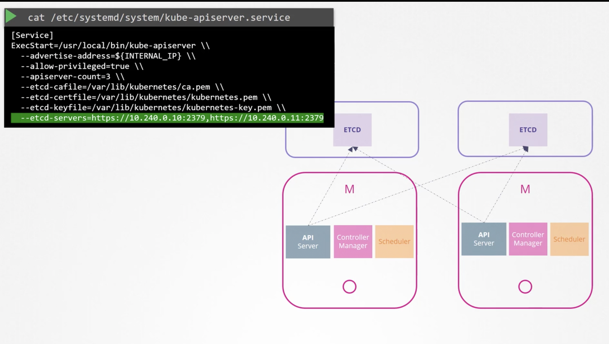

===================
Design Kubernetes
===================

k8s_preinstall

.. literalinclude:: ../../Four_September_2021_CKA_Recap/9.Design_install_k8s/1.demo_k8s_preinstall.sh
  :language: bash
  :caption: k8s_preinstall

ha_k8s

.. literalinclude:: ../../Four_September_2021_CKA_Recap/9.Design_install_k8s/2.High_Availability_in_K8S.sh
  :language: bash
  :caption: ha_k8s

ha_etcd

.. literalinclude:: ../../Four_September_2021_CKA_Recap/9.Design_install_k8s/3.ETCD_in_HA.sh
  :language: bash
  :caption: ha_etcd

* **HA-k8s-etcd** -

