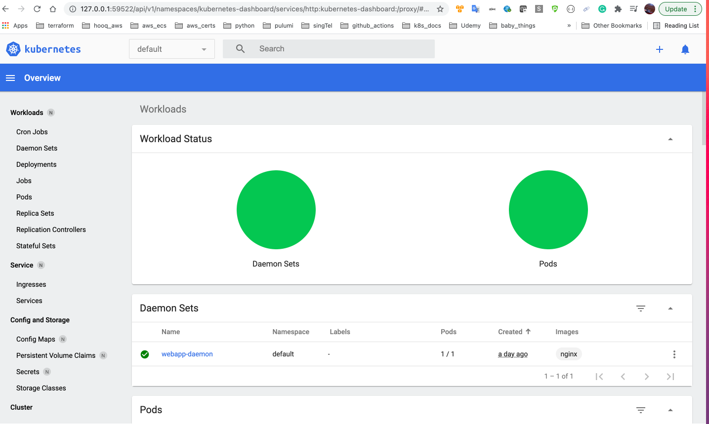

===========================
Logging and Monitoring
===========================

Monitorclustercomponents

.. literalinclude:: ../../Four_September_2021_CKA_Recap/3.Logging_and_Monitoring/1.demo_monitor_cluster_components.sh
  :language: bash
  :caption: Monitorclustercomponents

Monitorclustercomponentslabs

.. literalinclude:: ../../Four_September_2021_CKA_Recap/3.Logging_and_Monitoring/2.demo_monitor_k8s_components_labs.sh
  :language: bash
  :caption: Monitorclustercomponentslabs

applogs

.. literalinclude:: ../../Four_September_2021_CKA_Recap/3.Logging_and_Monitoring/3.demo_application_logs.sh
  :language: bash
  :caption: applogs

applogslabs

.. literalinclude:: ../../Four_September_2021_CKA_Recap/3.Logging_and_Monitoring/4.demo_application_logs_labs.sh
  :language: bash
  :caption: applogslabs

Monitoring pod 
----------------

podeventsimulator

.. literalinclude:: ../../Four_September_2021_CKA_Recap/3.Logging_and_Monitoring/event-simulator.yaml
  :language: yaml
  :caption: podeventsimulator:

Install Metrics-Server
--------------------------

* **Metrics Server in minikube** -

    
used below code to install metics-server in minikube

metrics-server code at `metrics-server`_.

.. _metrics-server: https://github.com/Bharathkumarraju/certified_kubernetes_administrator/tree/master/Four_September_2021_CKA_Recap/3.Logging_and_Monitoring/k8s_metrics-server/