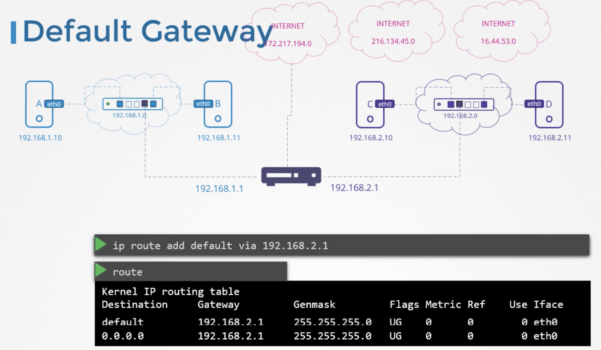
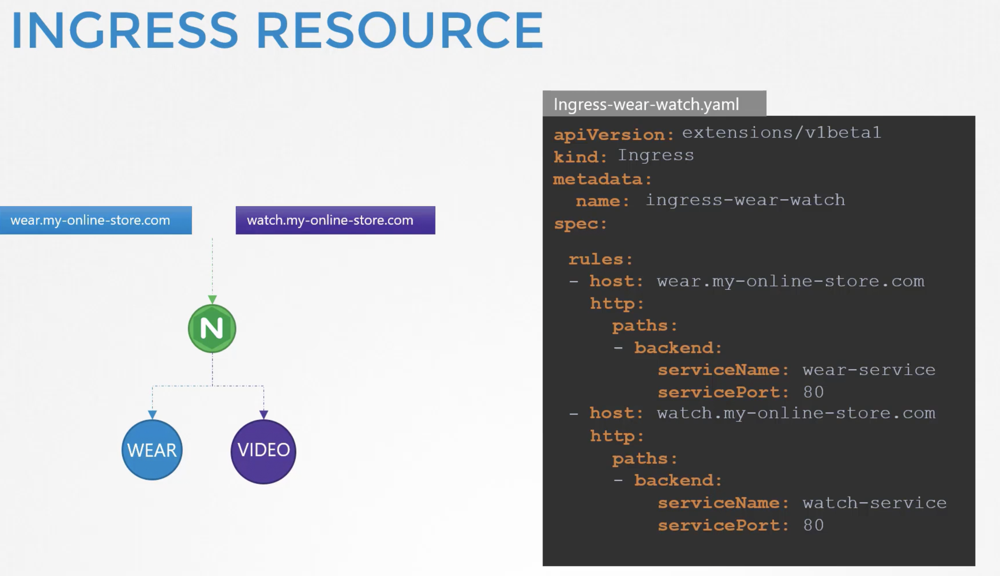

===============
Networking
===============

Networkconcepts

.. literalinclude:: ../../Four_September_2021_CKA_Recap/8.Networking/1.demo_networing_concepts.sh
  :language: bash
  :caption: Networkconcepts

vagrantfile

.. literalinclude:: ../../Four_September_2021_CKA_Recap/8.Networking/Vagrantfile
  :language: bash
  :caption: vagrantfile

* **Switches-Networks-Routers-Gateways** -

network_basics

.. literalinclude:: ../../Four_September_2021_CKA_Recap/8.Networking/2.Linux_networking_basics_with_k8s.sh
  :language: bash
  :caption: network_basics

dns_basics

.. literalinclude:: ../../Four_September_2021_CKA_Recap/8.Networking/3.DNS_in_Linux.sh
  :language: bash
  :caption: dns_basics

* **DNS in Linux** -

* **Network Namespaces** -

.. image:: ../../Four_September_2021_CKA_Recap/8.Networking/outside_network_can_connect_to_nameapaced_network.png
    :width: 80%
    :align: center

network_namespaces

.. literalinclude:: ../../Four_September_2021_CKA_Recap/8.Networking/4.linux_network_namespaces.sh
  :language: bash
  :caption: network_namespaces

docker_networking

.. literalinclude:: ../../Four_September_2021_CKA_Recap/8.Networking/5.docker_networking.sh
  :language: bash
  :caption: docker_networking

container_network_interface

.. literalinclude:: ../../Four_September_2021_CKA_Recap/8.Networking/6.container_network_interface.sh
  :language: bash
  :caption: container_network_interface

cluster_networking

.. literalinclude:: ../../Four_September_2021_CKA_Recap/8.Networking/7.cluster_networking.sh
  :language: bash
  :caption: cluster_networking

network_concepts

.. literalinclude:: ../../Four_September_2021_CKA_Recap/8.Networking/8.Networking_concepts_labs.sh
  :language: bash
  :caption: network_concepts

pod_networking

.. literalinclude:: ../../Four_September_2021_CKA_Recap/8.Networking/9.pod_networking.sh
  :language: bash
  :caption: pod_networking

CNI_k8s

.. literalinclude:: ../../Four_September_2021_CKA_Recap/8.Networking/10.CNI_in_kubernetes.sh
  :language: bash
  :caption: CNI_k8s

CNI_Weave

.. literalinclude:: ../../Four_September_2021_CKA_Recap/8.Networking/11.CNI_Weave.sh
  :language: bash
  :caption: CNI_Weave

CNI_weavelabs

.. literalinclude:: ../../Four_September_2021_CKA_Recap/8.Networking/12.CNI_Weaves_labs.sh
  :language: bash
  :caption: CNI_weavelabs

Deploy_network

.. literalinclude:: ../../Four_September_2021_CKA_Recap/8.Networking/13.Deploy_Network_solution.sh
  :language: bash
  :caption: Deploy_network

IPAM_Weave

.. literalinclude:: ../../Four_September_2021_CKA_Recap/8.Networking/14.IPAM_weave.sh
  :language: bash
  :caption: IPAM_Weave

IPAM_Weavelabs

.. literalinclude:: ../../Four_September_2021_CKA_Recap/8.Networking/15.IPAM_weave_labs.sh
  :language: bash
  :caption: IPAM_Weavelabs

Service_Networking

.. literalinclude:: ../../Four_September_2021_CKA_Recap/8.Networking/16.Service_Networking.sh
  :language: bash
  :caption: Service_Networking

Service_Networkinglabs

.. literalinclude:: ../../Four_September_2021_CKA_Recap/8.Networking/17.service_networking_labs.sh
  :language: bash
  :caption: Service_Networkinglabs

k8sDNS

.. literalinclude:: ../../Four_September_2021_CKA_Recap/8.Networking/18.DNS_in_kubernetes.sh
  :language: bash
  :caption: k8sDNS

k8scoreDNS

.. literalinclude:: ../../Four_September_2021_CKA_Recap/8.Networking/19.coreDNS_in_kubernetes.sh
  :language: bash
  :caption: k8scoreDNS

k8scoreDNSlabs

.. literalinclude:: ../../Four_September_2021_CKA_Recap/8.Networking/20.coreDNS_labs.sh
  :language: bash
  :caption: k8scoreDNSlabs

* **clusterIP vs NodePort** -

nginxconfigmap

.. literalinclude:: ../../Four_September_2021_CKA_Recap/8.Networking/nginx-configmap-for-nginx-controller.yaml
  :language: yaml
  :caption: nginxconfigmap

nginxingress

.. literalinclude:: ../../Four_September_2021_CKA_Recap/8.Networking/nginx-ingress-service.yaml
  :language: yaml
  :caption: nginxingress

nginxingresssa

.. literalinclude:: ../../Four_September_2021_CKA_Recap/8.Networking/nginx-ingress-serviceaccount.yaml
  :language: yaml
  :caption: nginxingresssa

* **nginx ingress controller** -

k8singress

.. literalinclude:: ../../Four_September_2021_CKA_Recap/8.Networking/21.Ingress_in_k8s.sh
  :language: bash
  :caption: k8singress

k8singress_resourcerules

.. literalinclude:: ../../Four_September_2021_CKA_Recap/8.Networking/22.ingress_resource_rules.yaml
  :language: yaml
  :caption: k8singress_resourcerules

* **nginx ingress url-paths and url-names** -

k8snginx_ingresscontroller

.. literalinclude:: ../../Four_September_2021_CKA_Recap/8.Networking/k8s-nginx-ingress-controller.yaml
  :language: yaml
  :caption: k8snginx_ingresscontroller

ingress_rewrite_targets

.. literalinclude:: ../../Four_September_2021_CKA_Recap/8.Networking/23.ingress_annotations_rewrite_targets.sh
  :language: bash
  :caption: ingress_rewrite_targets

ingress_rewrite_targetannotations

.. literalinclude:: ../../Four_September_2021_CKA_Recap/8.Networking/24.nginx_ingress_resource_annotations_rewrite_target.yaml
  :language: yaml
  :caption: ingress_rewrite_targetannotations

nginxingress_networking

.. literalinclude:: ../../Four_September_2021_CKA_Recap/8.Networking/25.nginx_ingress_networking_labs.sh
  :language: bash
  :caption: nginxingress_networking

ingress_rule

.. literalinclude:: ../../Four_September_2021_CKA_Recap/8.Networking/26.Add_new_ingress_rule.yaml
  :language: yaml
  :caption: ingress_rule

ingress_rule2

.. literalinclude:: ../../Four_September_2021_CKA_Recap/8.Networking/27.create_new_ingress_rule.yaml
  :language: yaml
  :caption: ingress_rule2

nginxingress_ncontrollerlabs

.. literalinclude:: ../../Four_September_2021_CKA_Recap/8.Networking/28.demo_create_nginx_ingress_controller_labs.sh
  :language: bash
  :caption: nginxingress_ncontrollerlabs

nginx_ingress_deploy

.. literalinclude:: ../../Four_September_2021_CKA_Recap/8.Networking/29.nginx_ingress_controller_deploy.yaml
  :language: yaml
  :caption: nginx_ingress_deploy

nginx_ingress_service

.. literalinclude:: ../../Four_September_2021_CKA_Recap/8.Networking/30.nginx_ingress_controller_service.yaml
  :language: yaml
  :caption: nginx_ingress_service

configure_ingress_rule

.. literalinclude:: ../../Four_September_2021_CKA_Recap/8.Networking/31.configure_ingress_rule_in_app-space.yaml
  :language: yaml
  :caption: configure_ingress_rule

